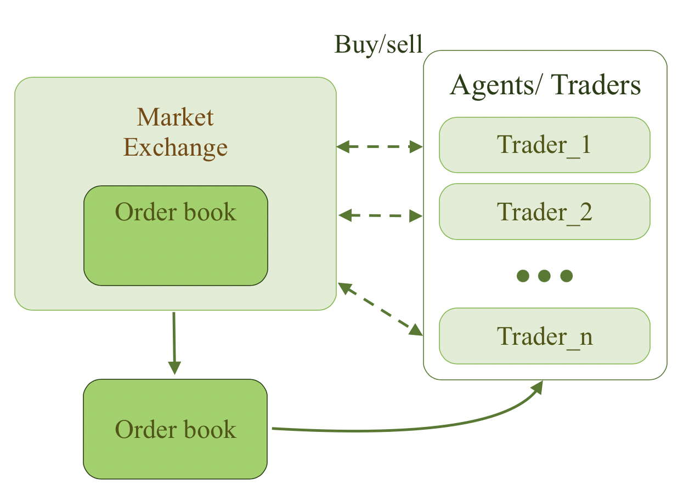
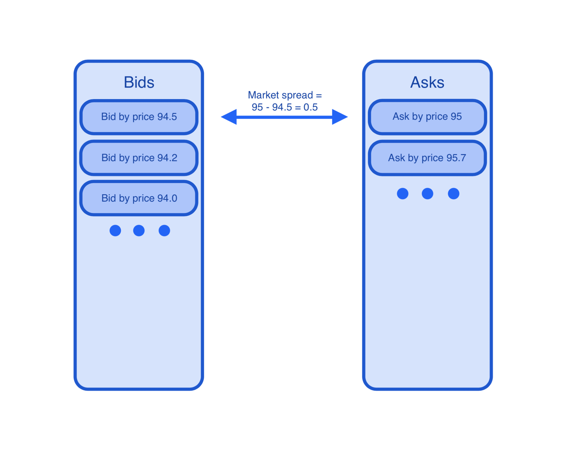

 

# exchange_realization

A platform for simulation exchange processes and testing trading algorythms.  

[Template article](https://link.springer.com/article/10.1007/s10479-018-3019-4). 

---------------
# Main idea.
The main idea of the article it is assumption that we can present market exchange as multiagent system, where other types of agents interact with each other by Market Exchange, where each agent can get the necessary information, and make various decisions according to its strategy.  

-------
## What's new in last version.   
New notebook with various combinations of agents was added.  

`exchange_with_other_params.ipynb`

-------
## Requirements.
* [Python](https://www.python.org/downloads/). 
* [Jupiter notebook](https://jupyter.org). 

-------
## Installation.
1. Run `git clone ....` on your terminal, or make    `Download ZIP`  from page source.  
2. Go into downloaded package.

----------
## Quick start.

1. Go into downloaded package.
2. Launch **client.py** file
3. After the main package downloaded, you can see new simulation of exchange in **data** folder.

----------
## Functional and parameters.  
You can check and change the main parameters of the model by way: `config/parameters_list.py`.  
There you can change the location of the saved files.

----------
## Input and output data.  
TBA.

----------
# How it works.
### Architecture
The architecture of our market we can present as multiagent system, where each agent has information about trading data. According with his strategy, he can make three types of actions. It is **buying**, **selling**, **cancelling** and **refraining** from any actions. 

When an agent makes a decision to buy or sell, he starts placing an order. For each order must be specified followinf parameters:
* Market direction (Buying or selling).
* Type of order (market or limit order).
* Value of shares in order.
* Order price (set the price for one share) (**Only for limit orders**).  

The following set of actions is available for interacting with the market:
* Making market orders (buying or selling).
* Making limit orders (buying or selling).
* Canselling orders by **order id** (Only for limit orders).  

It is necessary to clarify, how working the **Order Book** from Exchange.

Limit Order Book (**LOB**) consists of two sides of orders - **bids** and **asks**.  

**Bids** - limit orders for buying. They are sorting by decreasing price. If two orders have same price, they are sorting by the time of application.
**Asks** - limit orders for slling. They are sorting by increasing price. If two orders have same price, they are sorting by the time of application.

Each limit order has such parameters, as **price**, **volume**, **application time** and **order id**.  

The difference between prices of best bid and ask orders names **Spread**.  

If new limit order for buy/sell is bigger/smaller by price than best ask/bid order on opposite side of book, it starts to be executed at the price of purchased / sold shares. Current order may execute more than one opposite orders, if it's value of shares more than in best opposite order.  If value of current order less than in best opposite order, it may be executed, and best opposite order will be executed partially.  

Market orders are executing immediately, and  executing by price, which was installed by the sellers or buyers on the oher side of book. If the order has more than the total number of orders in the book, the order is partially executed. Then the remainder is entered in the limit orders book by current price.  

The price after the deal calculated as mean value by each share. This new price is recorded in the market data and now reflects the current market price.

-----------
### Simulation logic.  

In our model we have 5 types of agents. There are 2 types of fundamental traders, 2 types of chartists, and noise - traders type, which is intended to describe some zero - intellegence agents, and other indescribable noizes.  In our model each agent is represented by exactly one instance. Of course, in real exchange, there more than one instance of each agent. But if we dereference each agent and add a probabilistic approach to each agent's entry to the exchange, this disadvantage will disappear, but we will significantly save computing power

To replicate the mismatch in the timescales upon which market participants can act, during each period every agent is given the opportunity to act based on probability, δ_τ, that is determined by their type, τ, (market maker, trend follower, etc.). In more detail, to represent a high-frequency trader’s ability to react more quickly to market events than, say, a long term fundamental investor, we assigned a higher delta providing a higher chance of being chosen to act. Importantly, when chosen, agents are not required to act. This facet allows agents to vary their activity through time and in response the market, as with real-world market participants.

The probability of a member of each agent group acting is denoted δ_mm for market makers, δ_lc for liquidity consumers, δmr for mean reversion traders, δ_mt for momentum traders and δ_nt for noise traders. Upon being chosen to act, if an agent wishes to submit an order, it will communicate an order type, volume and price determined by that agent’s internal logic. The order is then submitted to the LOB where it is matched using price-time priority. If no match occurs then the order is stored in the book until it is later filled or canceled by the originating trader. Such a model conforms to the adaptive market hypothesis  as the market dynamics emerge from the interactions of a number of species of agents adapting to a changing environment using simple heuristics. Although the model contains a fair number of free parameters, those parameters are determined through experiment and found to be relatively insensitive to reasonable variation.   

Before starting the model, we already have a small price data sheet, to which we will add new data about the changed price in the future.  
The price formation in the model can be represented as follows:  

- At the each time step each agent can make decision to buying, selling, or doing nothing. If the agent makes decision to buing or selling, he can make limit or market order for buing or selling some shares with some volume.  
- If agent chooses market orders, he buying/selling shares at the price at which they are placed in the limit order book. If he choose limit order, their order places in Limit Orders Book.  
- When a specific order is executed, the purchase and sale price is determined by the price of securities that were previously issued to satisfy the order that started being executed.  
When each order executes, it's volume may be satisfy more than one order with each price. It can satisfy other orders with other initial price. After the order was executed, the new price is calculating as the average price for which one share was purchased/sold. This new price now represents the total exchange price of current paper.

-----------
### Market Maker logic
Market makers represent market participants who attempt to earn the spread by supplying liquidity on both sides of the LOB. In traditional markets, market makers were appointed but in modern electronic exchanges any agent is able to follow such a strategy. These agents simultaneously post an order on each side of the book, maintaining an approximately neutral position throughout the day. They make their income from the difference between their bids and oers. If one or both limit orders is executed, it will be replaced by a new one the next time the market maker is chosen to trade. Each round, the market maker generates a prediction for the sign of the next period’s order using a simple w period rolling-mean estimate. When a market maker predicts that a buy order will arrive next, she will set her sell limit order volume to a uniformly distributed random number between v_min and v_max and his buy limit order volume to v-.  

-----------
### Liquidity consumer logic
TBA

-----------
### Momentum trader logic
TBA

-----------
### Mean reversion trader logic
TBA

-----------
### Noise trader logic
TBA

-----------
### Validation and checking results
TBA

-----------
### Current rewiev
В ходе исследований поведения рынка и оценки основных его параметров были выявлены закономерности и параметры, позволяющие симулировать работу биржи с помощью мультиагенной системы, моделирующей поведение реальных агентов при условии, что оцениваемые параметры реальной биржи и смоделированной находятся в доверительной области, позволяющей не отвергать гипотезу о их равенстве. В качестве сравнительных метрик использовались такие показатели, как volatility clustering, autocorrelation of returns, long memory in order flow, extreme price events frequency, concave price impact.  

Полученная мультиагенная система призвана смоделировать и оценить основные рыночные показатели с целью дальнейшего анализа и поиска вариаций касаетльно включения в модель рынка новых типов агентов, или изменения поведения старых.  

На текущий момент система состоит из 5 типов агентов: это market makers, liquidity consumers, mean reversion traders, momentum traders и noise traders.  

Полученная система с текущим наборов агентов поможет в исследовании динамики и изменении рыночного поведения при внедрении новых типов агентов, таких как самообучающиеся трейдеры.  

Итоговые результаты позволят утверждать об изменении поведения динамики рынков при внедрении в них самообучающихся агентов в определённую сторону. Это даст возможность правильно интерпретировав полученные изменения говорить о состоятельности гипотезы о том, что на текущий момент в торговых рынках присутствуют самообучающиеся агенты и, вероятно их число растёт. Либо же наоборот, данные результаты будут в конечном счёте указывать на то, что число самообучающихся агентов на рынке незначительно и, вероятно не вносит существенных изменений в его динамику.
